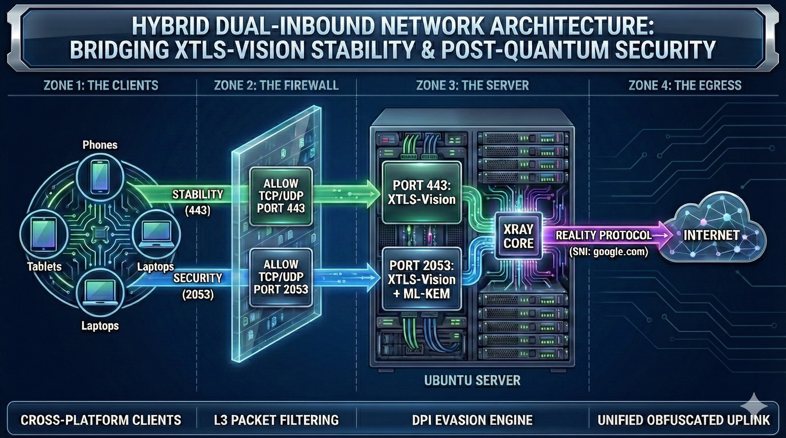

# HYBRID DUAL-INBOUND NETWORK ARCHITECTURE
## Bridging XTLS-Vision Stability & Post-Quantum Security

An advanced Xray architecture balancing XTLS-Vision stability with Post-Quantum security.

> **Status:** Active | **License:** MIT | **Platform:** Oracle Cloud (OCI)

## 📋 Executive Summary
This project implements a high-availability, censorship-resistant network infrastructure designed to solve the compatibility gap between legacy mobile clients and modern post-quantum security standards. By utilizing a **Dual-Inbound Strategy**, the system intelligently segregates traffic based on client capabilities, ensuring zero-downtime for iOS devices while maintaining maximum encryption security for desktops.

---

## 🏗 System Architecture

The core of this architecture is built upon **Xray-Core** with a split-routing mechanism:

### 1. The Stability Stream (Port 443)
* **Target:** Mobile Clients (iOS/Android) & High-Latency Networks.
* **Protocol:** `VLESS` + `Reality` + `XTLS-Vision`.
* **Engineering Decision:** **No Auth Headers**.
    * *Rationale:* To mitigate the "iOS Handshake Timeout" issue in restricted network environments, authentication overhead was removed on this port. Security is maintained strictly via TLS 1.3 encryption and Reality obfuscation. This is a calculated trade-off prioritizing availability.

### 2. The Security Stream (Port 2053)
* **Target:** Desktop Clients & Stable Networks.
* **Protocol:** `VLESS` + `Reality` + `XTLS-Vision`.
* **Security Layer:** **uTLS + ML-KEM (Post-Quantum Cryptography)**.
    * *Rationale:* Implements Kyber-768 encryption to protect traffic against "Harvest Now, Decrypt Later" quantum attacks.

---

## 🛡️ Key Features
* **Hybrid Inbound Logic:** Seamlessly handles both legacy and next-gen requests.
* **SNI Masquerading:** Simulates `google.com` traffic behavior to evade DPI detection.
* **Network Optimization:** Kernel-level **Google BBR** congestion control enabled for high-throughput.
* **Dual-Stack Firewall:** Synchronized L3 (Oracle Cloud) and L4 (UFW) rules for full TCP/UDP (QUIC) support.

---

## 🚀 Future Roadmap
This project is under active development. Planned features for Phase 2:
- [ ] **Monitoring & Alerting:** Integration with Uptime Kuma for real-time port health checks.
- [ ] **Automated Backups:** Daily cron jobs to backup X-UI database to secure object storage.
- [ ] **Dockerization:** Full containerization of the stack for rapid deployment.
- [ ] **High Availability:** Implementing a Failover Standby Server with DNS Load Balancing.

---

## 🛠️ Deployment / Usage

### Prerequisites
* A VPS (Ubuntu 20.04/22.04 LTS recommended).
* Basic knowledge of SSH and Linux.
* Xray-Core installed (v1.8.0+).

### Installation (Manual)
1.  **Install Xray-Core:**
    Use the official installation script or a panel like X-UI.
2.  **Apply Configuration:**
    Copy the `inbounds` section from `configs/xray-config-sample.json` to your Xray configuration file.
3.  **Optimize Kernel:**
    Enable BBR by adding `net.core.default_qdisc=fq` and `net.ipv4.tcp_congestion_control=bbr` to `/etc/sysctl.conf`.

---

## ⚠️ Disclaimer
This project is for educational and research purposes only. The author is not responsible for any misuse of the provided configurations.

---
*Created by [Your Name/ID]*
